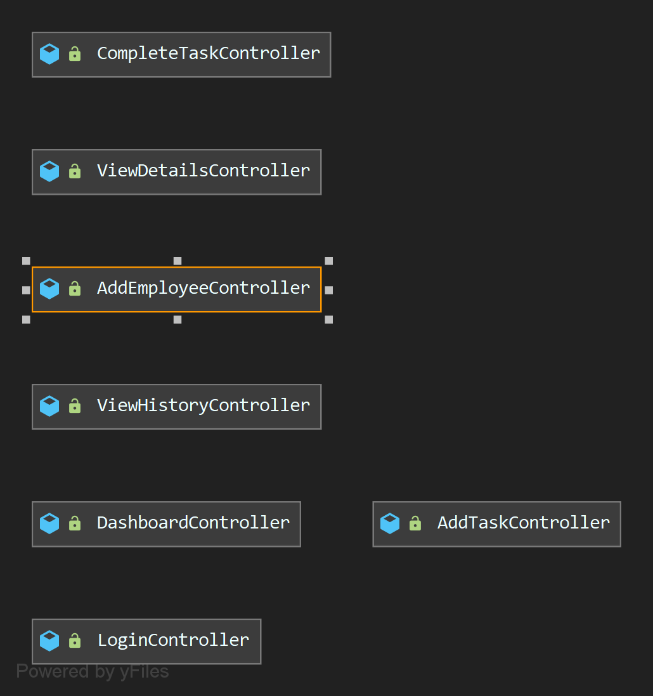
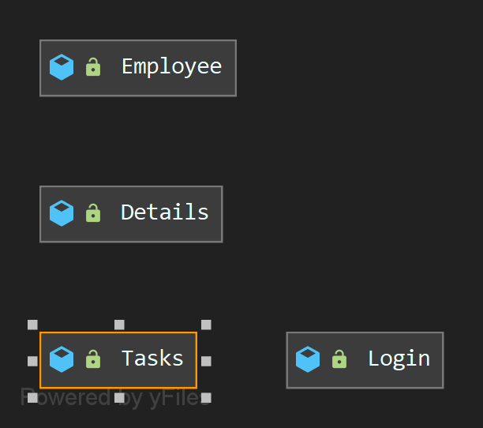
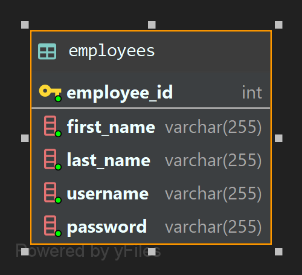
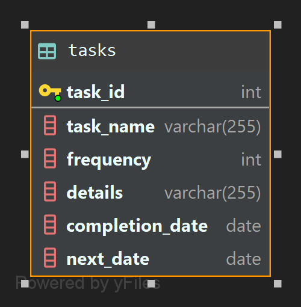

# Maintenance App

Project description: The GIBA Maintenance App tracks responsibilities and activites of GIBA maintenance personel. The project can perform the following duties:
  1. The system shall allow for new employees to be added to the database and be given access to the task tracking system.
  2. The system shall allow for a username and password verification system that either approves or declines users based on password and username combinations using SQL queries.
  3. The system shall allow for users to add and/or remove tasks from the database.
  4. The system shall display relevant information related to a selected task.
  5. The system shall allow for users to complete tasks.
  6. The system shall create an _audit trail_ for tracking what tasks employees complete and when.
  7. The system shall create a _report_ for tracking any relevant information related to a completed task.
  
Maintenance App was created solely by Andrew Cavallaro.

## Documentation

Please use the following link to view the <a href="https://acavallaro75.github.io/Maintenance_App/index.html" rel="nofollow">JavaDoc</a> for this project.

## Diagrams
##### Class Diagrams:

##### Database Visualization:

## Built With

- The integrated development environment (IDE) used for this project was IntelliJ IDEA Ultimate Edition. The Java Development Kit (JDK) is Java 11.0.6.

- The databases that were implemented in this project are MySQL databases. Each database (giba_employees and maintenance) contains one table: employees and tasks. The employee database tracks employee's names, usernames, and passwords and is used to verify login information to allow access to the program and track completion of tasks across the user interface. The maintenance database tracks the tasks ID number, name, completion date, and next date to be done by.

- The graphical user interface (GUI) was built using SceneBuilder and JFoenix.

## Contributing

If anyone would like to contribute, give feedback, or would like more information, feel free to email me at andrew.cavallarojr@gmail.com.

## Author
Andrew Cavallaro

## License

MIT License

Copyright (c) 2021 Andrew Cavallaro

Permission is hereby granted, free of charge, to any person obtaining a copy
of this software and associated documentation files (the "Software"), to deal
in the Software without restriction, including without limitation the rights
to use, copy, modify, merge, publish, distribute, sublicense, and/or sell
copies of the Software, and to permit persons to whom the Software is
furnished to do so, subject to the following conditions:

The above copyright notice and this permission notice shall be included in all
copies or substantial portions of the Software.

THE SOFTWARE IS PROVIDED "AS IS", WITHOUT WARRANTY OF ANY KIND, EXPRESS OR
IMPLIED, INCLUDING BUT NOT LIMITED TO THE WARRANTIES OF MERCHANTABILITY,
FITNESS FOR A PARTICULAR PURPOSE AND NONINFRINGEMENT. IN NO EVENT SHALL THE
AUTHORS OR COPYRIGHT HOLDERS BE LIABLE FOR ANY CLAIM, DAMAGES OR OTHER
LIABILITY, WHETHER IN AN ACTION OF CONTRACT, TORT OR OTHERWISE, ARISING FROM,
OUT OF OR IN CONNECTION WITH THE SOFTWARE OR THE USE OR OTHER DEALINGS IN THE
SOFTWARE.

